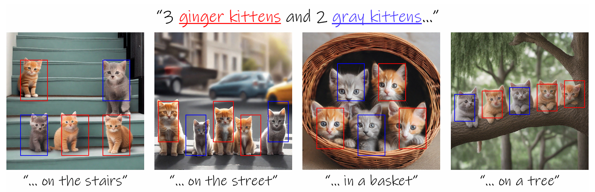
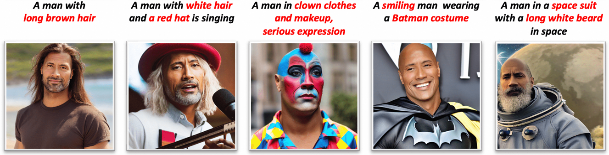

  
  
  
    
  

<h1 align="center">Awesome Controllable Diffusion</h1>

    <b> Papers and Resources on Adding Conditional Controls to Diffusion Models in the Era of AIGC.</b>

     Dive into the cutting-edge of controllable generation in diffusion models, a field revolutionized by pioneering works like ControlNet <a href=https://arxiv.org/abs/2302.05543>[1]</a> and DreamBooth <a href=https://arxiv.org/abs/2302.05543>[2]</a>. This repository is invaluable for those interested in advanced techniques for fine-grained synthesis control, ranging from subject-driven generation to intricate layout manipulations. While ControlNet and DreamBooth are key highlights, the collection spans a broader spectrum, including recent advancements and applications in image, video, and 3D generation.

  
🗂️ Table of Contents

  <ol>
    <li><a href="#papers">📝 Papers</a></li>
    <li><a href="#other-resources">🔗 Other Resources</a></li>
    <li><a href="#other-awesome-lists">🌟 Other Awesome Lists</a></li>
    <li><a href="#contributing">✍️ Contributing</a></li>
  </ol>

 
# <h1 id="papers">📝 Papers<h1/>

 
1. **[DreamBooth: Fine Tuning Text-to-Image Diffusion Models for Subject-Driven Generation.](https://arxiv.org/abs/2208.12242)**

    

    *Nataniel Ruiz, Yuanzhen Li, Varun Jampani, Yael Pritch, Michael Rubinstein, Kfir Aberman.* CVPR'23. 🔥
  
    

1. **[Adding Conditional Control to Text-to-Image Diffusion Models.](https://arxiv.org/abs/2302.05543)**

    

    *Lvmin Zhang, Anyi Rao, Maneesh Agrawala.* ICCV'23. 🔥

    

1. **[T2I-Adapter: Learning Adapters to Dig out More Controllable Ability for Text-to-Image Diffusion Models.](https://arxiv.org/abs/2302.08453)**

    

    *Chong Mou, Xintao Wang, Liangbin Xie, Yanze Wu, Jian Zhang, Zhongang Qi, Ying Shan, Xiaohu Qie.* Preprint 2023. 🔥

    

1. **[Subject-driven Text-to-Image Generation via Apprenticeship Learning.](https://arxiv.org/abs/2304.00186)**

    

    *Wenhu Chen, Hexiang Hu, Yandong Li, Nataniel Ruiz, Xuhui Jia, Ming-Wei Chang, William W. Cohen.* NeurIPS'23.

1. **[InstantBooth: Personalized Text-to-Image Generation without Test-Time Finetuning.](https://arxiv.org/abs/2304.03411)**

    

    *Jing Shi, Wei Xiong, Zhe Lin, Hyun Joon Jung.* Preprint 2023.

1. **[BLIP-Diffusion: Pre-trained Subject Representation for Controllable Text-to-Image Generation and Editing](https://arxiv.org/abs/2305.14720)**

    

    *Dongxu Li, Junnan Li, Steven C.H. Hoi.* NeurIPS'23. 🔥

    

1. **[ControlVideo: Conditional Control for One-shot Text-driven Video Editing and Beyond.](https://arxiv.org/abs/2305.17098)**

    

    *Min Zhao, Rongzhen Wang, Fan Bao, Chongxuan Li, Jun Zhu.* Preprint 2023.

1. **[StyleDrop: Text-to-Image Generation in Any Style.](https://arxiv.org/abs/2306.00983)**

    

    *Kihyuk Sohn, Nataniel Ruiz, Kimin Lee, Daniel Castro Chin, Irina Blok, Huiwen Chang, Jarred Barber, Lu Jiang, Glenn Entis, Yuanzhen Li, Yuan Hao, Irfan Essa, Michael Rubinstein, Dilip Krishnan.* NeurIPS'23. 🔥

    

1. **[Face0: Instantaneously Conditioning a Text-to-Image Model on a Face.](https://arxiv.org/abs/2306.06638)**

    

    *Dani Valevski, Danny Wasserman, Yossi Matias, Yaniv Leviathan.* SIGGRAPH Asia'23.

1. **[Controlling Text-to-Image Diffusion by Orthogonal Finetuning.](https://arxiv.org/abs/2306.07280)**

    

    *Zeju Qiu, Weiyang Liu, Haiwen Feng, Yuxuan Xue, Yao Feng, Zhen Liu, Dan Zhang, Adrian Weller, Bernhard Schölkopf.* NeruIPS'23.

1. **[Zero-shot spatial layout conditioning for text-to-image diffusion models.](https://arxiv.org/abs/2306.13754)**

    

    *Guillaume Couairon, Marlène Careil, Matthieu Cord, Stéphane Lathuilière, Jakob Verbeek.* ICCV'23.

1. **[IP-Adapter: Text Compatible Image Prompt Adapter for Text-to-Image Diffusion Models.](https://arxiv.org/abs/2308.06721)**

    

    *Hu Ye, Jun Zhang, Sibo Liu, Xiao Han, Wei Yang.* Preprint 2023. 🔥

    

1. **[StyleAdapter: A Single-Pass LoRA-Free Model for Stylized Image Generation.](https://arxiv.org/abs/2309.01770)**

    

    *Zhouxia Wang, Xintao Wang, Liangbin Xie, Zhongang Qi, Ying Shan, Wenping Wang, Ping Luo.* Preprint 2023.

1. **[DreamStyler: Paint by Style Inversion with Text-to-Image Diffusion Models.](https://arxiv.org/abs/2309.06933)**

    

    *Namhyuk Ahn, Junsoo Lee, Chunggi Lee, Kunhee Kim, Daesik Kim, Seung-Hun Nam, Kibeom Hong.* AAAI 2023.

1. **[Kosmos-G: Generating Images in Context with Multimodal Large Language Models](https://arxiv.org/abs/2310.02992)**

    

    *Xichen Pan, Li Dong, Shaohan Huang, Zhiliang Peng, Wenhu Chen, Furu Wei.* Preprint 2023. 🔥

    

1. **[An Image is Worth Multiple Words: Learning Object Level Concepts using Multi-Concept Prompt Learning.](https://arxiv.org/abs/2310.12274)**

    

    *Chen Jin, Ryutaro Tanno, Amrutha Saseendran, Tom Diethe, Philip Teare.* Preprint 2023.

1. **[CustomNet: Zero-shot Object Customization with Variable-Viewpoints in Text-to-Image Diffusion Models.](https://arxiv.org/abs/2310.19784)**

    

    *Ziyang Yuan, Mingdeng Cao, Xintao Wang, Zhongang Qi, Chun Yuan, Ying Shan.* Preprint 2023.

1. **[Cross-Image Attention for Zero-Shot Appearance Transfer.](https://arxiv.org/abs/2311.03335)**

    

    *Yuval Alaluf, Daniel Garibi, Or Patashnik, Hadar Averbuch-Elor, Daniel Cohen-Or.* Preprint 2023.

1. **[The Chosen One: Consistent Characters in Text-to-Image Diffusion Models.](https://arxiv.org/abs/2311.10093)**

    

    *Omri Avrahami, Amir Hertz, Yael Vinker, Moab Arar, Shlomi Fruchter, Ohad Fried, Daniel Cohen-Or, Dani Lischinski.* Preprint 2023.

1. **[MagicDance: Realistic Human Dance Video Generation with Motions & Facial Expressions Transfer.](https://arxiv.org/abs/2311.12052)**

    

    *Di Chang, Yichun Shi, Quankai Gao, Jessica Fu, Hongyi Xu, Guoxian Song, Qing Yan, Xiao Yang, Mohammad Soleymani.* Preprint 2023.

1. **[ZipLoRA: Any Subject in Any Style by Effectively Merging LoRAs.](https://arxiv.org/abs/2311.13600)**

    

    *Viraj Shah, Nataniel Ruiz, Forrester Cole, Erika Lu, Svetlana Lazebnik, Yuanzhen Li, Varun Jampani.* Preprint 2023.

1. **[StyleCrafter: Enhancing Stylized Text-to-Video Generation with Style Adapter.](https://arxiv.org/abs/2312.00330)**

    

    *Gongye Liu, Menghan Xia, Yong Zhang, Haoxin Chen, Jinbo Xing, Xintao Wang, Yujiu Yang, Ying Shan.* Preprint 2023.

1. **[Style Aligned Image Generation via Shared Attention.](https://arxiv.org/abs/2312.02133)**

    

    *Amir Hertz, Andrey Voynov, Shlomi Fruchter, Daniel Cohen-Or.* Preprint 2023. 🔥

    

1. **[FaceStudio: Put Your Face Everywhere in Seconds.](https://arxiv.org/abs/2312.02663)**

    

    *Yuxuan Yan, Chi Zhang, Rui Wang, Yichao Zhou, Gege Zhang, Pei Cheng, Gang Yu, Bin Fu.* Preprint 2023.

1. **[Context Diffusion: In-Context Aware Image Generation.](https://arxiv.org/abs/2312.03584)**

    

    *Ivona Najdenkoska, Animesh Sinha, Abhimanyu Dubey, Dhruv Mahajan, Vignesh Ramanathan, Filip Radenovic.* Preprint 2023.

1. **[PhotoMaker: Customizing Realistic Human Photos via Stacked ID Embedding.](https://arxiv.org/abs/2312.04461)**

    

    *Zhen Li, Mingdeng Cao, Xintao Wang, Zhongang Qi, Ming-Ming Cheng, Ying Shan.* Preprint 2023. 🔥

    

1. **[SCEdit: Efficient and Controllable Image Diffusion Generation via Skip Connection Editing.](arxiv.org/abs/2312.11392)**

    

    *Zeyinzi Jiang, Chaojie Mao, Yulin Pan, Zhen Han, Jingfeng Zhang.* Preprint 2023.

1. **[DreamTuner: Single Image is Enough for Subject-Driven Generation.](https://arxiv.org/abs/2312.13691)**

    

    *Miao Hua, Jiawei Liu, Fei Ding, Wei Liu, Jie Wu, Qian He.* Preprint 2023.

1. **[PALP: Prompt Aligned Personalization of Text-to-Image Models.](https://arxiv.org/abs/2401.06105)**

    

    *Qixun Wang, Xu Bai, Haofan Wang, Zekui Qin, Anthony Chen.* Preprint 2024.

1. **[InstantID: Zero-shot Identity-Preserving Generation in Seconds.](https://arxiv.org/abs/2401.07519)**

    

    *Qixun Wang, Xu Bai, Haofan Wang, Zekui Qin, Anthony Chen, Huaxia Li, Xu Tang, Yao Hu.* Preprint 2024. 🔥

    

1. **[Mastering Text-to-Image Diffusion: Recaptioning, Planning, and Generating with Multimodal LLMs.](https://arxiv.org/abs/2401.11708)**

    

    *Ling Yang, Zhaochen Yu, Chenlin Meng, Minkai Xu, Stefano Ermon, Bin Cui.* Preprint 2024. 🔥

    

1. **[UNIMO-G: Unified Image Generation through Multimodal Conditional Diffusion.](https://arxiv.org/abs/2401.13388)**

    

    *Wei Li, Xue Xu, Jiachen Liu, Xinyan Xiao.* Preprint 2024 🔥

    

1. **[Object-Driven One-Shot Fine-tuning of Text-to-Image Diffusion with Prototypical Embedding](https://arxiv.org/abs/2401.15708)**

    

    *Jianxiang Lu, Cong Xie, Hui Guo.* Preprint 2024.

1. **[Training-Free Consistent Text-to-Image Generation](https://arxiv.org/abs/2402.03286)**

    

    *Yoad Tewel, Omri Kaduri, Rinon Gal, Yoni Kasten, Lior Wolf, Gal Chechik, Yuval Atzmon.* Preprint 2024.

1. **[InstanceDiffusion: Instance-level Control for Image Generation](https://arxiv.org/abs/2402.03290)**

    

    *Xudong Wang, Trevor Darrell, Sai Saketh Rambhatla, Rohit Girdhar, Ishan Misra.* Preprint 2024.

1. **[Text2Street: Controllable Text-to-image Generation for Street Views](https://arxiv.org/abs/2402.04504)**

    

    *Jinming Su, Songen Gu, Yiting Duan, Xingyue Chen, Junfeng Luo.* Preprint 2024.

1. **[λ-ECLIPSE: Multi-Concept Personalized Text-to-Image Diffusion Models by Leveraging CLIP Latent Space](https://arxiv.org/abs/2402.05195)**

    

    *Maitreya Patel, Sangmin Jung, Chitta Baral, Yezhou Yang.* Preprint 2024.

1. **[ComFusion: Personalized Subject Generation in Multiple Specific Scenes From Single Image](https://arxiv.org/abs/2402.11849)**

    

    *Yan Hong, Jianfu Zhang.* Preprint 2024.

1. **[Direct Consistency Optimization for Compositional Text-to-Image Personalization](https://arxiv.org/abs/2402.12004)**

    

    *Kyungmin Lee, Sangkyung Kwak, Kihyuk Sohn, Jinwoo Shin.* Preprint 2024. 🔥

    

1. **[MuLan: Multimodal-LLM Agent for Progressive Multi-Object Diffusion](https://arxiv.org/abs/2402.12741)**

    

    *Sen Li, Ruochen Wang, Cho-Jui Hsieh, Minhao Cheng, Tianyi Zhou.* Preprint 2024.

1. **[RealCompo: Dynamic Equilibrium between Realism and Composition Improves Text-to-Image Diffusion Models](https://arxiv.org/abs/2402.12908)**

    

    *Xinchen Zhang, Ling Yang, Yaqi Cai, Zhaochen Yu, Jiake Xie, Ye Tian, Minkai Xu, Yong Tang, Yujiu Yang, Bin Cui.* Preprint 2024.

1. **[Visual Style Prompting with Swapping Self-Attention](https://arxiv.org/abs/2402.12974)**

    

    *Jaeseok Jeong, Junho Kim, Yunjey Choi, Gayoung Lee, Youngjung Uh.* Preprint 2024.

1. **[Gen4Gen: Generative Data Pipeline for Generative Multi-Concept Composition](https://arxiv.org/abs/2402.15504)**

    

    *Chun-Hsiao Yeh, Ta-Ying Cheng, He-Yen Hsieh, Chuan-En Lin, Yi Ma, Andrew Markham, Niki Trigoni, H.T. Kung, Yubei Chen.* Preprint 2024.

1. **[Multi-LoRA Composition for Image Generation](https://arxiv.org/abs/2402.16843)**

    

    *Ming Zhong, Yelong Shen, Shuohang Wang, Yadong Lu, Yizhu Jiao, Siru Ouyang, Donghan Yu, Jiawei Han, Weizhu Chen.* Preprint 2024.

1. **[FeedFace: Efficient Inference-based Face Personalization via Diffusion Models](https://openreview.net/forum?id=PqPKBcamy3)**

    

    *Chendong Xiang, Armando Fortes, Khang Hui Chua, Hang Su, Jun Zhu.* Tiny Papers @ ICLR 2024. 🔥

    

1. **[Make-Your-3D: Fast and Consistent Subject-Driven 3D Content Generation](https://arxiv.org/abs/2403.09625)**

    

    *Fangfu Liu, Hanyang Wang, Weiliang Chen, Haowen Sun, Yueqi Duan.* ECCV 2024.

1. **[Continuous, Subject-Specific Attribute Control in T2I Models by Identifying Semantic Directions](https://arxiv.org/abs/2403.17064)**

    

    *Stefan Andreas Baumann, Felix Krause, Michael Neumayr, Nick Stracke, Vincent Tao Hu, Björn Ommer.* Preprint 2024.

1. **[IDAdapter: Learning Mixed Features for Tuning-Free Personalization of Text-to-Image Models](https://arxiv.org/abs/2403.13535)**

    

    *Siying Cui, Jia Guo, Xiang An, Jiankang Deng, Yongle Zhao, Xinyu Wei, Ziyong Feng.* Preprint 2024. 🔥

    

1. **[Be Yourself: Bounded Attention for Multi-Subject Text-to-Image Generation](https://arxiv.org/abs/2403.16990)**

    

    *Omer Dahary, Or Patashnik, Kfir Aberman, Daniel Cohen-Or.* Preprint 2024. 🔥

    

1. **[FlashFace: Human Image Personalization with High-fidelity Identity Preservation](https://arxiv.org/abs/2403.17008)**

    

    *Shilong Zhang, Lianghua Huang, Xi Chen, Yifei Zhang, Zhi-Fan Wu, Yutong Feng, Wei Wang, Yujun Shen, Yu Liu, Ping Luo.* Preprint 2024. 🔥

    

1. **[Concept Weaver: Enabling Multi-Concept Fusion in Text-to-Image Models](https://arxiv.org/abs/2404.03913)**

    

    *Gihyun Kwon, Simon Jenni, Dingzeyu Li, Joon-Young Lee, Jong Chul Ye, Fabian Caba Heilbron.* Preprint 2024.

1. **[Identity Decoupling for Multi-Subject Personalization of Text-to-Image Models](https://arxiv.org/abs/2404.04243)**

    

    *Sangwon Jang, Jaehyeong Jo, Kimin Lee, Sung Ju Hwang.* Preprint 2024. 🔥

    

1. **[ControlNet++: Improving Conditional Controls with Efficient Consistency Feedback](https://arxiv.org/abs/2404.07987)**

    

    *Ming Li, Taojiannan Yang, Huafeng Kuang, Jie Wu, Zhaoning Wang, Xuefeng Xiao, Chen Chen.* Preprint 2024.

1. **[Ctrl-Adapter: An Efficient and Versatile Framework for Adapting Diverse Controls to Any Diffusion Model](https://arxiv.org/abs/2404.09967)**

    

    *Han Lin, Jaemin Cho, Abhay Zala, Mohit Bansal.* Preprint 2024.

1. **[MaxFusion: Plug&Play Multi-Modal Generation in Text-to-Image Diffusion Models](https://arxiv.org/abs/2404.09977)**

    

    *Nithin Gopalakrishnan Nair, Jeya Maria Jose Valanarasu, Vishal M Patel.* Preprint 2024.

1. **[MoA: Mixture-of-Attention for Subject-Context Disentanglement in Personalized Image Generation](https://arxiv.org/abs/2404.11565)**

    

    *Kuan-Chieh Wang, Daniil Ostashev, Yuwei Fang, Sergey Tulyakov, Kfir Aberman.* Preprint 2024.

1. **[Prompt Optimizer of Text-to-Image Diffusion Models for Abstract Concept Understanding](https://arxiv.org/abs/2404.11589)**

    

    *Zezhong Fan, Xiaohan Li, Chenhao Fang, Topojoy Biswas, Kaushiki Nag, Jianpeng Xu, Kannan Achan.* WWW'24.

1. **[MoMA: Multimodal LLM Adapter for Fast Personalized Image Generation](https://arxiv.org/abs/2404.05674)**

    

    *Kunpeng Song, Yizhe Zhu, Bingchen Liu, Qing Yan, Ahmed Elgammal, Xiao Yang.* Preprint 2024. 🔥

    

1. **[StyleBooth: Image Style Editing with Multimodal Instruction](https://arxiv.org/abs/2404.12154)**

    

    *Zhen Han, Chaojie Mao, Zeyinzi Jiang, Yulin Pan, Jingfeng Zhang.* Preprint 2024. 🔥

    

1. **[MultiBooth: Towards Generating All Your Concepts in an Image from Text](https://arxiv.org/abs/2404.14239)**

    

    *Chenyang Zhu, Kai Li, Yue Ma, Chunming He, Li Xiu.* Preprint 2024.

1. **[ID-Aligner: Enhancing Identity-Preserving Text-to-Image Generation with Reward Feedback Learning](https://arxiv.org/abs/2404.15449)**

    

    *Weifeng Chen, Jiacheng Zhang, Jie Wu, Hefeng Wu, Xuefeng Xiao, Liang Lin.* Preprint 2024.

1. **[PuLID: Pure and Lightning ID Customization via Contrastive Alignment](https://arxiv.org/abs/2404.16022)**

    

    *Zinan Guo, Yanze Wu, Zhuowei Chen, Lang Chen, Qian He.* Preprint 2024.

1. **[InstantFamily: Masked Attention for Zero-shot Multi-ID Image Generation](https://arxiv.org/abs/2404.19427)**

    

    *Chanran Kim, Jeongin Lee, Shichang Joung, Bongmo Kim, Yeul-Min Baek.* Preprint 2024.

1. **[StoryDiffusion: Consistent Self-Attention for Long-Range Image and Video Generation](https://arxiv.org/abs/2405.01434)**

    

    *Yupeng Zhou, Daquan Zhou, Ming-Ming Cheng, Jiashi Feng, Qibin Hou.* Preprint 2024. 🔥

    

1. **[Customizing Text-to-Image Models with a Single Image Pair](https://arxiv.org/abs/2405.01536)**

    

    *Maxwell Jones, Sheng-Yu Wang, Nupur Kumari, David Bau, Jun-Yan Zhu.* Preprint 2024.

1. **[Compositional Text-to-Image Generation with Dense Blob Representations](https://arxiv.org/abs/2405.08246)**

    

    *Weili Nie, Sifei Liu, Morteza Mardani, Chao Liu, Benjamin Eckart, Arash Vahdat.* ICML 2024. 🔥

    

1. **[FreeCustom: Tuning-Free Customized Image Generation for Multi-Concept Composition](https://arxiv.org/abs/2405.13870)**

    

    *Ganggui Ding, Canyu Zhao, Wen Wang, Zhen Yang, Zide Liu, Hao Chen, Chunhua Shen.* CVPR 2024.

1. **[RB-Modulation: Training-Free Personalization of Diffusion Models using Stochastic Optimal Control](https://arxiv.org/abs/2405.17401)**

    

    *Litu Rout, Yujia Chen, Nataniel Ruiz, Abhishek Kumar, Constantine Caramanis, Sanjay Shakkottai, Wen-Sheng Chu.* Preprint 2024. 🔥

    

1. **[MS-Diffusion: Multi-subject Zero-shot Image Personalization with Layout Guidance](https://arxiv.org/abs/2406.07209)**

    

    *X. Wang, Siming Fu, Qihan Huang, Wanggui He, Hao Jiang.* Preprint 2024.

1. **[Zero-Painter: Training-Free Layout Control for Text-to-Image Synthesis](https://arxiv.org/abs/2406.04032)**

    

    *Marianna Ohanyan, Hayk Manukyan, Zhangyang Wang, Shant Navasardyan, Humphrey Shi.* Preprint 2024. 🔥

    

1. **[Ctrl-X: Controlling Structure and Appearance for Text-To-Image Generation Without Guidance](https://arxiv.org/abs/2406.07540)**

    

    *Kuan Heng Lin, Sicheng Mo, Ben Klingher, Fangzhou Mu, Bolei Zhou.* Preprint 2024. 🔥

    

1. **[Instant 3D Human Avatar Generation using Image Diffusion Models](https://arxiv.org/abs/2406.07516)**

    

    *Nikos Kolotouros, Thiemo Alldieck, Enric Corona, Eduard Gabriel Bazavan, Cristian Sminchisescu.* Preprint 2024.

1. **[Personalized Residuals for Concept-Driven Text-to-Image Generation](https://arxiv.org/abs/2405.12978)**

    

    *Cusuh Ham, Matthew Fisher, James Hays, Nicholas Kolkin, Yuchen Liu, Richard Zhang, Tobias Hinz.* CVPR 2024.

1. **[pOps: Photo-Inspired Diffusion Operators](https://arxiv.org/abs/2406.01300)**

    

    *Elad Richardson, Yuval Alaluf, Ali Mahdavi-Amiri, Daniel Cohen-Or.* Preprint 2024. 🔥

    

1. **[EMMA: Your Text-to-Image Diffusion Model Can Secretly Accept Multi-Modal Prompts](https://arxiv.org/abs/2406.09162)**

    

    *Yucheng Han, Rui Wang, Chi Zhang, Juntao Hu, Pei Cheng, Bin Fu, Hanwang Zhang.* Preprint 2024.

1. **[Sketch-Guided Scene Image Generation](https://arxiv.org/abs/2407.06469)**

    

    *Tianyu Zhang, Xiaoxuan Xie, Xusheng Du, Haoran Xie.* Preprint 2024.

1. **[SEED-Story: Multimodal Long Story Generation with Large Language Model](https://arxiv.org/abs/2407.08683)**

    

    *Shuai Yang, Yuying Ge, Yang Li, Yukang Chen, Yixiao Ge, Ying Shan, Yingcong Chen.* Preprint 2024.

1. **[Training-free Composite Scene Generation for Layout-to-Image Synthesis](https://arxiv.org/abs/2407.13609)**

    

    *Jiaqi Liu, Tao Huang, Chang Xu.* ECCV 2024. 🔥

    

1. **[ViPer: Visual Personalization of Generative Models via Individual Preference Learning](https://arxiv.org/abs/2407.17365)**

    

    *Sogand Salehi, Mahdi Shafiei, Teresa Yeo, Roman Bachmann, Amir Zamir.* Preprint 2024.

1. **[IPAdapter-Instruct: Resolving Ambiguity in Image-based Conditioning using Instruct Prompts](https://arxiv.org/abs/2408.03209)**

    

    *Ciara Rowles, Shimon Vainer, Dante De Nigris, Slava Elizarov, Konstantin Kutsy, Simon Donné.* Preprint 2024. 🔥

    

1. **[Sketch2Scene: Automatic Generation of Interactive 3D Game Scenes from User's Casual Sketches](https://arxiv.org/abs/2408.03209)**

    

    *Yongzhi Xu, Yonhon Ng, Yifu Wang, Inkyu Sa, Yunfei Duan, Yang Li, Pan Ji, Hongdong Li.* Preprint 2024.

    <a href="#readme-top" style="text-decoration: none; color: #007bff; font-weight: bold;">
        ↑ Back to Top ↑
    </a>

 # <h1 id="other-resources">🔗 Other Resources# <h1/>

 

1. **[Regional Prompter](https://github.com/hako-mikan/sd-webui-regional-prompter)**  Set a prompt to a divided region.

    <a href="#readme-top" style="text-decoration: none; color: #007bff; font-weight: bold;">
        ↑ Back to Top ↑
    </a>

 
 # <h1 id="other-awesome-lists">🌟 Other Awesome Lists<h1/>

1. **[Awesome-LLM-Reasoning](https://github.com/atfortes/Awesome-LLM-Reasoning)**  Collection of papers and resources on Reasoning in Large Language Models.

1. **[Awesome-Controllable-T2I-Diffusion-Models](https://github.com/PRIV-Creation/Awesome-Controllable-T2I-Diffusion-Models)**  A collection of resources on controllable generation with text-to-image diffusion models.

    <a href="#readme-top" style="text-decoration: none; color: #007bff; font-weight: bold;">
        ↑ Back to Top ↑
    </a>

 # <h1 id="contributing">✍️ Contributing # <h1/>

- Add a new paper or update an existing paper, thinking about which category the work should belong to.
- Use the same format as existing entries to describe the work.
- Add the abstract link of the paper (`/abs/` format if it is an arXiv publication).

**Don't worry if you do something wrong, it will be fixed for you!**

## Contributors

## Star History

