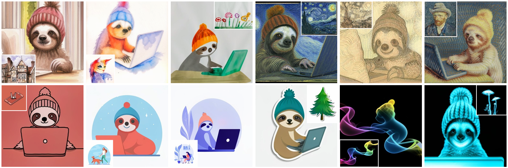

  
  
  
    
  

<h1 align="center">Awesome Controllable Diffusion</h1>

    <b> Papers and Resources on Adding Conditional Controls to Diffusion Models in the Era of AIGC.</b>

  
🗂️ Table of Contents

  <ol>
    <li><a href="#papers">📝 Papers</a></li>
      <ul>
        <li><a href="#2024"> 2024</a></li>
        <li><a href="#2023"> 2023</a></li>
      </ul>
    <li><a href="#other-resources">🔗 Other Resources</a></li>
    <li><a href="#other-awesome-lists">🌟 Other Awesome Lists</a></li>
    <li><a href="#contributing">✍️ Contributing</a></li>
  </ol>

 
# <h1 id="papers">📝 Papers<h1/>

## 2025

1. **[Bokeh Diffusion: Defocus Blur Control in Text-to-Image Diffusion Models.](https://arxiv.org/abs/2503.08434)** 🔥 [[project](https://atfortes.github.io/projects/bokeh-diffusion/)] [[paper](https://arxiv.org/abs/2503.08434)] [[code](https://github.com/atfortes/BokehDiffusion)]

    *Armando Fortes, Tianyi Wei, Shangchen Zhou, Xingang Pan.* Preprint 2025.

    

   

## 2024

1. **[IFAdapter: Instance Feature Control for Grounded Text-to-Image Generation.](https://arxiv.org/abs/2409.08240)** 🔥 [[project](https://ifadapter.github.io/)] [[paper](https://arxiv.org/abs/2409.08240)] [[code](https://github.com/WUyinwei-hah/IFAdapter)]

    *Yinwei Wu, Xianpan Zhou, Bing Ma, Xuefeng Su, Kai Ma, Xinchao Wang.* Preprint 2024.

    

   

1. **[CSGO: Content-Style Composition in Text-to-Image Generation.](https://arxiv.org/abs/2408.16766)** [[project](https://csgo-gen.github.io/)] [[paper](https://arxiv.org/abs/2408.16766)] [[code](https://github.com/instantX-research/CSGO)]

    *Peng Xing, Haofan Wang, Yanpeng Sun, Qixun Wang, Xu Bai, Hao Ai, Renyuan Huang, Zechao Li.* Preprint 2024.

    

1. **[Generative Photomontage.](https://arxiv.org/abs/2408.07116)** [[project](https://lseancs.github.io/generativephotomontage/)] [[paper](https://arxiv.org/abs/2408.07116)] [[code](https://github.com/lseancs/GenerativePhotomontage)]

    *Sean J. Liu, Nupur Kumari, Ariel Shamir, Jun-Yan Zhu.* Preprint 2024.

    

1. **[Sketch2Scene: Automatic Generation of Interactive 3D Game Scenes from User's Casual Sketches.](https://arxiv.org/abs/2408.04567)** [[project](https://xrvisionlabs.github.io/Sketch2Scene/)] [[paper](https://arxiv.org/abs/2408.04567)]

    *Yongzhi Xu, Yonhon Ng, Yifu Wang, Inkyu Sa, Yunfei Duan, Yang Li, Pan Ji, Hongdong Li.* Preprint 2024.

    

1. **[IPAdapter-Instruct: Resolving Ambiguity in Image-based Conditioning using Instruct Prompts.](https://arxiv.org/abs/2408.03209)** [[project](https://unity-research.github.io/IP-Adapter-Instruct.github.io/)] [[paper](https://arxiv.org/abs/2408.03209)] [[code](https://github.com/unity-research/IP-Adapter-Instruct)]

    *Ciara Rowles, Shimon Vainer, Dante De Nigris, Slava Elizarov, Konstantin Kutsy, Simon Donné.* Preprint 2024.

    

1. **[ViPer: Visual Personalization of Generative Models via Individual Preference Learning.](https://arxiv.org/abs/2407.17365)** [[project](https://viper.epfl.ch/)] [[paper](https://arxiv.org/abs/2407.17365)] [[code](https://github.com/EPFL-VILAB/ViPer)]

    *Sogand Salehi, Mahdi Shafiei, Teresa Yeo, Roman Bachmann, Amir Zamir.* ECCV'24.

    

1. **[Training-free Composite Scene Generation for Layout-to-Image Synthesis.](https://arxiv.org/abs/2407.13609)** [[paper](https://arxiv.org/abs/2407.13609)] [[code](https://github.com/Papple-F/csg)]

    *Jiaqi Liu, Tao Huang, Chang Xu.* ECCV'24.

    

1. **[SEED-Story: Multimodal Long Story Generation with Large Language Model.](https://arxiv.org/abs/2407.08683)** [[paper](https://arxiv.org/abs/2407.08683)] [[code](https://github.com/TencentARC/SEED-Story)]

    *Shuai Yang, Yuying Ge, Yang Li, Yukang Chen, Yixiao Ge, Ying Shan, Yingcong Chen.* Preprint 2024.

    

1. **[Sketch-Guided Scene Image Generation.](https://arxiv.org/abs/2407.06469)** [[paper](https://arxiv.org/abs/2407.06469)]

    *Tianyu Zhang, Xiaoxuan Xie, Xusheng Du, Haoran Xie.* Preprint 2024.

    

1. **[Instant 3D Human Avatar Generation using Image Diffusion Models.](https://arxiv.org/abs/2406.07516)** [[project](https://www.nikoskolot.com/avatarpopup/)] [[paper](https://www.nikoskolot.com/avatarpopup/)]

    *Nikos Kolotouros, Thiemo Alldieck, Enric Corona, Eduard Gabriel Bazavan, Cristian Sminchisescu.* ECCV'24.

    

1. **[Ctrl-X: Controlling Structure and Appearance for Text-To-Image Generation Without Guidance.](https://arxiv.org/abs/2406.07540)** 🔥 [[project](https://genforce.github.io/ctrl-x/)] [[paper](https://arxiv.org/abs/2406.07540)] [[code](https://github.com/genforce/ctrl-x)]

    *Kuan Heng Lin, Sicheng Mo, Ben Klingher, Fangzhou Mu, Bolei Zhou.* Preprint 2024.

    

    

1. **[Zero-Painter: Training-Free Layout Control for Text-to-Image Synthesis.](https://arxiv.org/abs/2406.04032)** [[paper](https://arxiv.org/abs/2406.04032)] [[code](https://github.com/Picsart-AI-Research/Zero-Painter)]

    *Marianna Ohanyan, Hayk Manukyan, Zhangyang Wang, Shant Navasardyan, Humphrey Shi.* CVPR'24.

    

1. **[pOps: Photo-Inspired Diffusion Operators.](https://arxiv.org/abs/2406.01300)** 🔥 [[project](https://popspaper.github.io/pOps/)] [[paper](https://arxiv.org/abs/2406.01300)] [[code](https://github.com/pOpsPaper/pOps)]

    *Elad Richardson, Yuval Alaluf, Ali Mahdavi-Amiri, Daniel Cohen-Or.* Preprint 2024.

    

    

1. **[RB-Modulation: Training-Free Personalization of Diffusion Models using Stochastic Optimal Control.](https://arxiv.org/abs/2405.17401)** [[project](https://rb-modulation.github.io/)] [[paper](https://arxiv.org/abs/2405.17401)] [[code](https://github.com/google/RB-Modulation)]

    *Litu Rout, Yujia Chen, Nataniel Ruiz, Abhishek Kumar, Constantine Caramanis, Sanjay Shakkottai, Wen-Sheng Chu.* Preprint 2024. 🔥

    

    

1. **[FreeCustom: Tuning-Free Customized Image Generation for Multi-Concept Composition.](https://arxiv.org/abs/2405.13870)** [[project](https://aim-uofa.github.io/FreeCustom/)] [[paper](https://arxiv.org/abs/2405.13870)] [[code](https://github.com/aim-uofa/FreeCustom)]

    *Ganggui Ding, Canyu Zhao, Wen Wang, Zhen Yang, Zide Liu, Hao Chen, Chunhua Shen.* CVPR'24.

    

1. **[Personalized Residuals for Concept-Driven Text-to-Image Generation.](https://arxiv.org/abs/2405.12978)** [[project](https://cusuh.github.io/personalized-residuals/)] [[paper](https://arxiv.org/abs/2405.12978)]

    *Cusuh Ham, Matthew Fisher, James Hays, Nicholas Kolkin, Yuchen Liu, Richard Zhang, Tobias Hinz.* CVPR'24.

    

1. **[Compositional Text-to-Image Generation with Dense Blob Representations.](https://arxiv.org/abs/2405.08246)** 🔥 [[project](https://blobgen-2d.github.io/)] [[paper](https://arxiv.org/abs/2405.08246)]

    *Weili Nie, Sifei Liu, Morteza Mardani, Chao Liu, Benjamin Eckart, Arash Vahdat.* ICML'24.

    

    

1. **[Customizing Text-to-Image Models with a Single Image Pair.](https://arxiv.org/abs/2405.01536)** [[project](https://paircustomization.github.io/)] [[paper](https://arxiv.org/abs/2405.01536)] [[code](https://github.com/PairCustomization/PairCustomization)]

    *Maxwell Jones, Sheng-Yu Wang, Nupur Kumari, David Bau, Jun-Yan Zhu.* Preprint 2024.

    

1. **[StoryDiffusion: Consistent Self-Attention for Long-Range Image and Video Generation.](https://arxiv.org/abs/2405.01434)** [[paper](https://arxiv.org/abs/2405.01434)]

    *Yupeng Zhou, Daquan Zhou, Ming-Ming Cheng, Jiashi Feng, Qibin Hou.* Preprint 2024.

    

1. **[InstantFamily: Masked Attention for Zero-shot Multi-ID Image Generation.](https://arxiv.org/abs/2404.19427)** [[paper](https://arxiv.org/abs/2404.19427)]

    *Chanran Kim, Jeongin Lee, Shichang Joung, Bongmo Kim, Yeul-Min Baek.* Preprint 2024.

    

1. **[PuLID: Pure and Lightning ID Customization via Contrastive Alignment.](https://arxiv.org/abs/2404.16022)** [[paper](https://arxiv.org/abs/2404.16022)] [[code](https://github.com/ToTheBeginning/PuLID)]

    *Zinan Guo, Yanze Wu, Zhuowei Chen, Lang Chen, Qian He.* Tech Report 2024.

    

1. **[MultiBooth: Towards Generating All Your Concepts in an Image from Text.](https://arxiv.org/abs/2404.14239)** [[project](https://multibooth.github.io/)] [[paper](https://arxiv.org/abs/2404.14239)] [[code](https://github.com/chenyangzhu1/MultiBooth)]

    *Chenyang Zhu, Kai Li, Yue Ma, Chunming He, Li Xiu.* Preprint 2024.

    

1. **[StyleBooth: Image Style Editing with Multimodal Instruction.](https://arxiv.org/abs/2404.12154)** [[project](https://ali-vilab.github.io/stylebooth-page/)] [[paper](https://arxiv.org/abs/2404.12154)] [[code](https://github.com/modelscope/scepter)]

    *Zhen Han, Chaojie Mao, Zeyinzi Jiang, Yulin Pan, Jingfeng Zhang.* Preprint 2024.

    

1. **[MoMA: Multimodal LLM Adapter for Fast Personalized Image Generation.](https://arxiv.org/abs/2404.05674)** 🔥 [[project](https://moma-adapter.github.io/)] [[paper](https://arxiv.org/abs/2404.05674)] [[code](https://github.com/bytedance/MoMA/tree/main)]

    *Kunpeng Song, Yizhe Zhu, Bingchen Liu, Qing Yan, Ahmed Elgammal, Xiao Yang.* ECCV'24.

    

    

1. **[Prompt Optimizer of Text-to-Image Diffusion Models for Abstract Concept Understanding.](https://arxiv.org/abs/2404.11589)** [[paper](https://arxiv.org/abs/2404.11589)]

    *Zezhong Fan, Xiaohan Li, Chenhao Fang, Topojoy Biswas, Kaushiki Nag, Jianpeng Xu, Kannan Achan.* WWW'24.

    

1. **[MoA: Mixture-of-Attention for Subject-Context Disentanglement in Personalized Image Generation.](https://arxiv.org/abs/2404.11565)** [[project](https://snap-research.github.io/mixture-of-attention/)] [[paper](https://arxiv.org/abs/2404.11565)] [[code](https://github.com/snap-research/mixture-of-attention)]

    *Kuan-Chieh Wang, Daniil Ostashev, Yuwei Fang, Sergey Tulyakov, Kfir Aberman.* Preprint 2024.

    

1. **[MaxFusion: Plug&Play Multi-Modal Generation in Text-to-Image Diffusion Models.](https://arxiv.org/abs/2404.09977)** [[project](https://nithin-gk.github.io/maxfusion.github.io/)] [[paper](https://arxiv.org/abs/2404.09977)] [[code](https://github.com/Nithin-GK/MaxFusion)]

    *Nithin Gopalakrishnan Nair, Jeya Maria Jose Valanarasu, Vishal M Patel.* ECCV'24.

    

1. **[Ctrl-Adapter: An Efficient and Versatile Framework for Adapting Diverse Controls to Any Diffusion Model.](https://arxiv.org/abs/2404.09967)** [[project](https://ctrl-adapter.github.io/)] [[paper](https://arxiv.org/abs/2404.09967)] [[code](https://github.com/HL-hanlin/Ctrl-Adapter)]

    *Han Lin, Jaemin Cho, Abhay Zala, Mohit Bansal.* Preprint 2024.

    

1. **[ControlNet++: Improving Conditional Controls with Efficient Consistency Feedback.](https://arxiv.org/abs/2404.07987)** [[project](https://liming-ai.github.io/ControlNet_Plus_Plus/)] [[paper](https://arxiv.org/abs/2404.07987)] [[code](https://github.com/liming-ai/ControlNet_Plus_Plus)]

    *Ming Li, Taojiannan Yang, Huafeng Kuang, Jie Wu, Zhaoning Wang, Xuefeng Xiao, Chen Chen.* ECCV'24.

    

1. **[Identity Decoupling for Multi-Subject Personalization of Text-to-Image Models.](https://arxiv.org/abs/2404.04243)** [[project](https://mudi-t2i.github.io/)] [[paper](https://arxiv.org/abs/2404.04243)]

    *Sangwon Jang, Jaehyeong Jo, Kimin Lee, Sung Ju Hwang.* Preprint 2024.

    

1. **[Concept Weaver: Enabling Multi-Concept Fusion in Text-to-Image Models.](https://arxiv.org/abs/2404.03913)** [[paper](https://arxiv.org/abs/2404.03913)]

    *Gihyun Kwon, Simon Jenni, Dingzeyu Li, Joon-Young Lee, Jong Chul Ye, Fabian Caba Heilbron.* CVPR'24.

    

1. **[FlashFace: Human Image Personalization with High-fidelity Identity Preservation.](https://arxiv.org/abs/2403.17008)** [[project](https://jshilong.github.io/flashface-page/)] [[paper](https://arxiv.org/abs/2403.17008)] [[code](https://github.com/ali-vilab/FlashFace)]

    *Shilong Zhang, Lianghua Huang, Xi Chen, Yifei Zhang, Zhi-Fan Wu, Yutong Feng, Wei Wang, Yujun Shen, Yu Liu, Ping Luo.* Preprint 2024.

    

1. **[Be Yourself: Bounded Attention for Multi-Subject Text-to-Image Generation.](https://arxiv.org/abs/2403.16990)** [[project](https://omer11a.github.io/bounded-attention/)] [[paper](https://arxiv.org/abs/2403.16990)] [[code](https://github.com/omer11a/bounded-attention)]

    *Omer Dahary, Or Patashnik, Kfir Aberman, Daniel Cohen-Or.* ECCV'24.

    

1. **[Continuous Subject-Specific Attribute Control in T2I Models by Identifying Semantic Directions.](https://arxiv.org/abs/2403.17064)** [[project](https://compvis.github.io/attribute-control/)] [[paper](https://arxiv.org/abs/2403.17064)] [[code](https://github.com/CompVis/attribute-control)]

    *Stefan Andreas Baumann, Felix Krause, Michael Neumayr, Nick Stracke, Vincent Tao Hu, Björn Ommer.* Preprint 2024.

    

1. **[Make-Your-3D: Fast and Consistent Subject-Driven 3D Content Generation.](https://arxiv.org/abs/2403.09625)** [[project](https://liuff19.github.io/Make-Your-3D/)] [[paper](https://arxiv.org/abs/2403.09625)] [[code](https://github.com/liuff19/Make-Your-3D)]

    *Fangfu Liu, Hanyang Wang, Weiliang Chen, Haowen Sun, Yueqi Duan.* ECCV'24.

    

1. **[FeedFace: Efficient Inference-based Face Personalization via Diffusion Models.](https://openreview.net/forum?id=PqPKBcamy3)** 🔥 [[paper](https://openreview.net/forum?id=PqPKBcamy3)] [[code](https://github.com/Xiang-cd/FeedFace)]

    *Chendong Xiang, Armando Fortes, Khang Hui Chua, Hang Su, Jun Zhu.* Tiny Papers @ ICLR'24.

    

    

1. **[Multi-LoRA Composition for Image Generation.](https://arxiv.org/abs/2402.16843)** [[project](https://maszhongming.github.io/Multi-LoRA-Composition/)] [[paper](https://arxiv.org/abs/2402.16843)] [[code](https://github.com/maszhongming/Multi-LoRA-Composition)]

    *Ming Zhong, Yelong Shen, Shuohang Wang, Yadong Lu, Yizhu Jiao, Siru Ouyang, Donghan Yu, Jiawei Han, Weizhu Chen.* Preprint 2024.

    

1. **[Gen4Gen: Generative Data Pipeline for Generative Multi-Concept Composition.](https://arxiv.org/abs/2402.15504)** [[project](https://danielchyeh.github.io/Gen4Gen/)] [[paper](https://arxiv.org/abs/2402.15504)] [[code](https://github.com/louisYen/Gen4Gen)]

    *Chun-Hsiao Yeh, Ta-Ying Cheng, He-Yen Hsieh, Chuan-En Lin, Yi Ma, Andrew Markham, Niki Trigoni, H.T. Kung, Yubei Chen.* Tech Report 2024.

    

1. **[Visual Style Prompting with Swapping Self-Attention.](https://arxiv.org/abs/2402.12974)** [[project](https://curryjung.github.io/VisualStylePrompt/)] [[paper](https://arxiv.org/abs/2402.12974)] [[code](https://github.com/naver-ai/Visual-Style-Prompting)]

    *Jaeseok Jeong, Junho Kim, Yunjey Choi, Gayoung Lee, Youngjung Uh.* Preprint 2024.

    

1. **[RealCompo: Dynamic Equilibrium between Realism and Composition Improves Text-to-Image Diffusion Models.](https://arxiv.org/abs/2402.12908)** [[paper](https://arxiv.org/abs/2402.12908)] [[code](https://github.com/YangLing0818/RealCompo)]

    *Xinchen Zhang, Ling Yang, Yaqi Cai, Zhaochen Yu, Jiake Xie, Ye Tian, Minkai Xu, Yong Tang, Yujiu Yang, Bin Cui.* Preprint 2024.

    

1. **[Direct Consistency Optimization for Compositional Text-to-Image Personalization.](https://arxiv.org/abs/2402.12004)** [[project](https://dco-t2i.github.io/)] [[paper](https://arxiv.org/abs/2402.12004)] [[code](https://github.com/kyungmnlee/dco)]

    *Kyungmin Lee, Sangkyung Kwak, Kihyuk Sohn, Jinwoo Shin.* Preprint 2024.

    

1. **[InstanceDiffusion: Instance-level Control for Image Generation.](https://arxiv.org/abs/2402.03290)** [[project](https://people.eecs.berkeley.edu/~xdwang/projects/InstDiff/)] [[paper](https://arxiv.org/abs/2402.03290)] [[code](https://github.com/frank-xwang/InstanceDiffusion)]

    *Xudong Wang, Trevor Darrell, Sai Saketh Rambhatla, Rohit Girdhar, Ishan Misra.* CVPR'24.

    

1. **[Training-Free Consistent Text-to-Image Generation.](https://arxiv.org/abs/2402.03286)** [[project](https://research.nvidia.com/labs/par/consistory/)] [[paper](https://arxiv.org/abs/2402.03286)]

    *Yoad Tewel, Omri Kaduri, Rinon Gal, Yoni Kasten, Lior Wolf, Gal Chechik, Yuval Atzmon.* SIGGRAPH'24.

    

1. **[UNIMO-G: Unified Image Generation through Multimodal Conditional Diffusion.](https://arxiv.org/abs/2401.13388)** 🔥 [[project](https://unimo-ptm.github.io/)] [[paper](https://arxiv.org/abs/2401.13388)]

    *Wei Li, Xue Xu, Jiachen Liu, Xinyan Xiao.* ACL'24.

    

    

1. **[Mastering Text-to-Image Diffusion: Recaptioning, Planning, and Generating with Multimodal LLMs.](https://arxiv.org/abs/2401.11708)** 🔥 [[paper](https://arxiv.org/abs/2401.11708)] [[code](https://github.com/YangLing0818/RPG-DiffusionMaster)]

    *Ling Yang, Zhaochen Yu, Chenlin Meng, Minkai Xu, Stefano Ermon, Bin Cui.* ICML'24.

    

    

1. **[InstantID: Zero-shot Identity-Preserving Generation in Seconds.](https://arxiv.org/abs/2401.07519)** [[project](https://github.com/InstantID/InstantID)] [[paper](https://arxiv.org/abs/2401.07519)] [[code](https://github.com/InstantID/InstantID)]

    *Qixun Wang, Xu Bai, Haofan Wang, Zekui Qin, Anthony Chen, Huaxia Li, Xu Tang, Yao Hu.* Tech Report 2024. 🔥

    

    

1. **[PALP: Prompt Aligned Personalization of Text-to-Image Models.](https://arxiv.org/abs/2401.06105)** [[project](https://prompt-aligned.github.io/)] [[paper](https://arxiv.org/abs/2401.06105)]

    *Qixun Wang, Xu Bai, Haofan Wang, Zekui Qin, Anthony Chen.* Preprint 2024.

    

1. **[SCEdit: Efficient and Controllable Image Diffusion Generation via Skip Connection Editing.](arxiv.org/abs/2312.11392)** [[project](https://scedit.github.io/)] [[paper](https://arxiv.org/abs/2312.04461)] [[code](https://github.com/ali-vilab/SCEdit)]

    *Zeyinzi Jiang, Chaojie Mao, Yulin Pan, Zhen Han, Jingfeng Zhang.* CVPR'24.

    

1. **[PhotoMaker: Customizing Realistic Human Photos via Stacked ID Embedding.](https://arxiv.org/abs/2312.04461)** [[project](https://photo-maker.github.io/)] [[paper](https://arxiv.org/abs/2312.04461)] [[code](https://github.com/TencentARC/PhotoMaker)]

    *Zhen Li, Mingdeng Cao, Xintao Wang, Zhongang Qi, Ming-Ming Cheng, Ying Shan.* CVPR'24. 🔥

    

    

1. **[Context Diffusion: In-Context Aware Image Generation.](https://arxiv.org/abs/2312.03584)** [[project](https://ivonajdenkoska.github.io/contextdiffusion/main.html)] [[paper](https://arxiv.org/abs/2312.03584)]

    *Ivona Najdenkoska, Animesh Sinha, Abhimanyu Dubey, Dhruv Mahajan, Vignesh Ramanathan, Filip Radenovic.* ECCV'24.

    

1. **[Style Aligned Image Generation via Shared Attention.](https://arxiv.org/abs/2312.02133)** 🔥 [[project](https://style-aligned-gen.github.io/)] [[paper](https://arxiv.org/abs/2312.02133)] [[code](https://github.com/google/style-aligned/)]

    *Amir Hertz, Andrey Voynov, Shlomi Fruchter, Daniel Cohen-Or.* CVPR'24.

    

    

1. **[Visual Anagrams: Generating Multi-View Optical Illusions with Diffusion Models.](https://arxiv.org/abs/2311.17919)** [[project](https://dangeng.github.io/visual_anagrams/)] [[paper](https://arxiv.org/abs/2311.17919)] [[code](https://github.com/dangeng/visual_anagrams)]

    *Daniel Geng, Inbum Park, Andrew Owens.* CVPR'24.

    

1. **[MagicPose: Realistic Human Poses and Facial Expressions Retargeting with Identity-aware Diffusion.](https://arxiv.org/abs/2311.12052)** [[project](https://boese0601.github.io/magicdance/)] [[paper](https://arxiv.org/abs/2311.12052)] [[code](https://github.com/Boese0601/MagicDance)]

    *Di Chang, Yichun Shi, Quankai Gao, Jessica Fu, Hongyi Xu, Guoxian Song, Qing Yan, Xiao Yang, Mohammad Soleymani.* ICML'24.

    

1. **[The Chosen One: Consistent Characters in Text-to-Image Diffusion Models.](https://arxiv.org/abs/2311.10093)** [[project](https://omriavrahami.com/the-chosen-one/)] [[paper](https://arxiv.org/abs/2311.10093)] [[code](https://github.com/ZichengDuan/TheChosenOne)]

    *Omri Avrahami, Amir Hertz, Yael Vinker, Moab Arar, Shlomi Fruchter, Ohad Fried, Daniel Cohen-Or, Dani Lischinski.* SIGGRAPH'24.

    

1. **[Cross-Image Attention for Zero-Shot Appearance Transfer.](https://arxiv.org/abs/2311.03335)** [[project](https://garibida.github.io/cross-image-attention)] [[paper](https://arxiv.org/abs/2311.03335)] [[code](https://github.com/garibida/cross-image-attention)]

    *Yuval Alaluf, Daniel Garibi, Or Patashnik, Hadar Averbuch-Elor, Daniel Cohen-Or.* SIGGRAPH'24.

    

1. **[Kosmos-G: Generating Images in Context with Multimodal Large Language Models](https://arxiv.org/abs/2310.02992)** 🔥 [[project](https://xichenpan.github.io/kosmosg)] [[paper](https://arxiv.org/abs/2310.02992)] [[code](https://aka.ms/Kosmos-G)]

    *Xichen Pan, Li Dong, Shaohan Huang, Zhiliang Peng, Wenhu Chen, Furu Wei.* ICLR'24.

    

    

1. **[InstantBooth: Personalized Text-to-Image Generation without Test-Time Finetuning.](https://arxiv.org/abs/2304.03411)**  [[paper](https://arxiv.org/abs/2304.03411)]

    *Jing Shi, Wei Xiong, Zhe Lin, Hyun Joon Jung.* CVPR'24.

    

## 2023

1. **[ZipLoRA: Any Subject in Any Style by Effectively Merging LoRAs.](https://arxiv.org/abs/2311.13600)** [[project](https://ziplora.github.io/)] [[paper](https://arxiv.org/abs/2311.13600)]

    *Viraj Shah, Nataniel Ruiz, Forrester Cole, Erika Lu, Svetlana Lazebnik, Yuanzhen Li, Varun Jampani.* Preprint 2023.

    

1. **[IP-Adapter: Text Compatible Image Prompt Adapter for Text-to-Image Diffusion Models.](https://arxiv.org/abs/2308.06721)** 🔥 [[project](https://ip-adapter.github.io/)] [[paper](https://arxiv.org/abs/2308.06721)] [[code]()]

    *Hu Ye, Jun Zhang, Sibo Liu, Xiao Han, Wei Yang.* Tech Report 2023.

    

    

1. **[Zero-shot spatial layout conditioning for text-to-image diffusion models.](https://arxiv.org/abs/2306.13754)**

    *Guillaume Couairon, Marlène Careil, Matthieu Cord, Stéphane Lathuilière, Jakob Verbeek.* ICCV'23.

    

1. **[Controlling Text-to-Image Diffusion by Orthogonal Finetuning.](https://arxiv.org/abs/2306.07280)**  [[project](https://oft.wyliu.com/)] [[paper](https://arxiv.org/abs/2306.07280)] [[code](https://github.com/Zeju1997/oft)]

    *Zeju Qiu, Weiyang Liu, Haiwen Feng, Yuxuan Xue, Yao Feng, Zhen Liu, Dan Zhang, Adrian Weller, Bernhard Schölkopf.* NeruIPS'23.

    

1. **[Face0: Instantaneously Conditioning a Text-to-Image Model on a Face.](https://arxiv.org/abs/2306.06638)** [[paper](https://arxiv.org/abs/2306.06638)]

    *Dani Valevski, Danny Wasserman, Yossi Matias, Yaniv Leviathan.* SIGGRAPH Asia'23.

    

1. **[StyleDrop: Text-to-Image Generation in Any Style.](https://arxiv.org/abs/2306.00983)** 🔥 [[project](https://styledrop.github.io/)] [[paper](https://arxiv.org/abs/2306.00983)]

    *Kihyuk Sohn, Nataniel Ruiz, Kimin Lee, Daniel Castro Chin, Irina Blok, Huiwen Chang, Jarred Barber, Lu Jiang, Glenn Entis, Yuanzhen Li, Yuan Hao, Irfan Essa, Michael Rubinstein, Dilip Krishnan.* NeurIPS'23.

    

    

1. **[BLIP-Diffusion: Pre-trained Subject Representation for Controllable Text-to-Image Generation and Editing.](https://arxiv.org/abs/2305.14720)** 🔥 [[project](https://dxli94.github.io/BLIP-Diffusion-website/)] [[paper](https://arxiv.org/abs/2305.14720)] [[code](https://github.com/salesforce/LAVIS/tree/main/projects/blip-diffusion)]

    *Dongxu Li, Junnan Li, Steven C.H. Hoi.* NeurIPS'23.
   
    

    

1. **[Subject-driven Text-to-Image Generation via Apprenticeship Learning.](https://arxiv.org/abs/2304.00186)** [[paper](https://arxiv.org/abs/2304.00186)]

    *Wenhu Chen, Hexiang Hu, Yandong Li, Nataniel Ruiz, Xuhui Jia, Ming-Wei Chang, William W. Cohen.* NeurIPS'23.

    

1. **[T2I-Adapter: Learning Adapters to Dig out More Controllable Ability for Text-to-Image Diffusion Models.](https://arxiv.org/abs/2302.08453)** 🔥 [[paper](https://arxiv.org/abs/2302.08453)] [[code](https://github.com/TencentARC/T2I-Adapter)]

    *Chong Mou, Xintao Wang, Liangbin Xie, Yanze Wu, Jian Zhang, Zhongang Qi, Ying Shan, Xiaohu Qie.* Tech Report 2023.

    

    

1. **[Adding Conditional Control to Text-to-Image Diffusion Models.](https://arxiv.org/abs/2302.05543)** 🔥 [[paper](https://arxiv.org/abs/2302.05543)] [[code](https://github.com/lllyasviel/ControlNet)]

    *Lvmin Zhang, Anyi Rao, Maneesh Agrawala.* ICCV'23.

    

    

1. **[GLIGEN: Open-Set Grounded Text-to-Image Generation.](https://arxiv.org/abs/2301.07093)** 🔥 [[project](https://gligen.github.io/)] [[paper](https://arxiv.org/abs/2301.07093)] [[code](https://github.com/gligen/GLIGEN)]

    *Yuheng Li, Haotian Liu, Qingyang Wu, Fangzhou Mu, Jianwei Yang, Jianfeng Gao, Chunyuan Li, Yong Jae Lee.* CVPR'23.

    

1. **[Multi-Concept Customization of Text-to-Image Diffusion.](https://arxiv.org/abs/2212.04488)** [[project](https://www.cs.cmu.edu/~custom-diffusion/)] [[paper](https://arxiv.org/abs/2212.04488)] [[code](https://github.com/adobe-research/custom-diffusion)]

    *Nupur Kumari, Bingliang Zhang, Richard Zhang, Eli Shechtman, Jun-Yan Zhu.* CVPR'23.

    

1. **[DreamBooth: Fine Tuning Text-to-Image Diffusion Models for Subject-Driven Generation.](https://arxiv.org/abs/2208.12242)** 🔥 [[project](https://dreambooth.github.io/)] [[paper](https://arxiv.org/abs/2208.12242)]

    *Nataniel Ruiz, Yuanzhen Li, Varun Jampani, Yael Pritch, Michael Rubinstein, Kfir Aberman.* CVPR'23.

    

    

    <a href="#readme-top" style="text-decoration: none; color: #007bff; font-weight: bold;">
        ↑ Back to Top ↑
    </a>

 # <h1 id="other-resources">🔗 Other Resources# <h1/>

 

1. **[Regional Prompter](https://github.com/hako-mikan/sd-webui-regional-prompter)**  Set a prompt to a divided region.

    <a href="#readme-top" style="text-decoration: none; color: #007bff; font-weight: bold;">
        ↑ Back to Top ↑
    </a>

 
 # <h1 id="other-awesome-lists">🌟 Other Awesome Lists<h1/>

1. **[Awesome-LLM-Reasoning](https://github.com/atfortes/Awesome-LLM-Reasoning)**  Collection of papers and resources on Reasoning in Large Language Models.

1. **[Awesome-Controllable-T2I-Diffusion-Models](https://github.com/PRIV-Creation/Awesome-Controllable-T2I-Diffusion-Models)**  A collection of resources on controllable generation with text-to-image diffusion models.

    <a href="#readme-top" style="text-decoration: none; color: #007bff; font-weight: bold;">
        ↑ Back to Top ↑
    </a>

 # <h1 id="contributing">✍️ Contributing # <h1/>

- Add a new paper or update an existing paper, thinking about which category the work should belong to.
- Use the same format as existing entries to describe the work.
- Add the abstract link of the paper (`/abs/` format if it is an arXiv publication).

**Don't worry if you do something wrong, it will be fixed for you!**

## Contributors

## Star History

